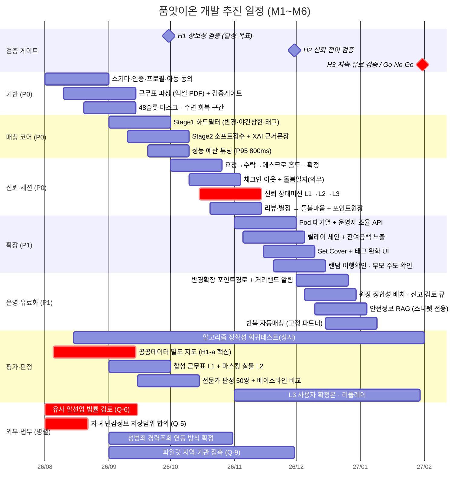

# 개발 추진체계 (간트 차트)

> 1달 간격. 시작 **2026-08-01 가정** — 실제 킥오프 일자에 맞춰 전체를 평행 이동하면 된다.
> 작업 항목은 [TECH_LOGIC.md](TECH_LOGIC.md) §13(P0/P1/P2), 검증 마일스톤은 [HYPOTHESIS_ROADMAP.md](HYPOTHESIS_ROADMAP.md), 평가 항목은 [AI_MATCHING_EVAL.md](AI_MATCHING_EVAL.md)와 대응한다.
>
> **일정 전제 확인 필요(Q-21)**: [별첨]은 "5주 해커톤"을 전제하고 [유료]는 "6개월 파일럿"을 전제한다. 아래는 **5주 MVP 개발 → 6개월 파일럿**으로 이어지는 것으로 해석해 구성했다. 두 일정의 관계가 다르면 M1~M2 구간을 압축해야 한다.

---

## 1. 전체 일정



---

## 2. 월별 목표와 산출물

| 월 | 개발 목표 | 검증·산출물 | 관문 |
|---|---|---|---|
| **M1** (8월) | 기반 — 스키마, 인증, 프로필·아동 동의, 근무표 파싱, 48슬롯 마스크 | 근무표 50장 수집 · 라벨셋 구축 착수 | 법무 2건 착수 |
| **M2** (9월) | 매칭 코어 — Stage1/2, XAI, 성능 튜닝 | **파싱 셀 정확도 95%** · 밀도별 후보 보유율 곡선 · B0~B3 비교 | **H1 게이트** |
| **M3** (10월) | 신뢰·세션 — 에스크로, 체크인·일지, **L1→L2→L3**, 돌봄마음 | 신뢰 전이 로그 계측 시작 | 성범죄 조회 방식 확정 |
| **M4** (11월) | 확장 — Pod 대기열, 릴레이, 태그 완화, 이행 확인 | 릴레이 완전피복률 100%(반례 테스트) | **H2 게이트** |
| **M5** (12월) | 운영·유료화 — 반경 확장(포인트), 원장 배치, RAG, 반복 매칭 | RAG Recall@5 90% · 범위 밖 수락률·노쇼율 계측 | — |
| **M6** (1월) | 안정화 · 지표 정리 | 평가 리포트(표본 수·신뢰구간 포함) · 12개월 손익 재계산 | **H3 / Go-No-Go** |

---

## 3. 임계 경로 (crit 표시 3건)

1. **신뢰 상태머신 L1→L2→L3** (M3) — 이게 없으면 단독위탁을 열 수 없고 H2 검증 자체가 불가능하다. 안전 핵심이라 P0에서 뺄 수 없다
2. **유사 알선업 법률 검토 (Q-6)** — 결과에 따라 포인트·수수료 구조가 바뀔 수 있어 **M1에 착수**해야 한다. 뒤로 미루면 이미 만든 걸 뜯게 된다
3. **자녀 민감정보 저장범위 합의 (Q-5)** — [별첨]이 "비가역 결정이므로 착수 전 반드시 합의"로 지정. **스키마를 확정하기 전에** 끝나야 하므로 3주 안에 닫는다

법무 2건이 개발보다 먼저 시작하는 이유는 단순하다. **결정이 늦으면 코드가 아니라 이미 저장된 데이터를 고쳐야 한다.**

---

## 4. 병렬 트랙과 의존 관계

```
근무표 파싱 ──> 48슬롯 마스크 ──> Stage1 ──> Stage2 ──> [H1]
                                              │
자녀정보 합의(Q-5) ──> 스키마 확정 ──────────┘

세션 기록 ──> 신뢰 전이 ──> 단독위탁 해금 ──> [H2] ──> 재매칭·Pod ──> [H3]
                  │
        법률 검토(Q-6) ──> 포인트·수수료 구조 확정
```

- **파싱이 늦어지면 전부 늦어진다.** M1의 최우선 과제이며, 스캔 사진은 Tier C(수동 입력)로 미뤄 임계 경로에서 뺀다
- 평가 트랙(f1)은 M1부터 **상시 실행**한다. 알고리즘 정확성은 파일럿 데이터가 필요 없으므로 개발과 동시에 닫는다
- 유료화(e1)는 H2 이후에 배치했다. 맡기는 사람이 없는데 반경을 파는 것은 순서가 틀렸다

---

## 5. 이 일정의 리스크

| 리스크 | 영향 | 완화 |
|---|---|---|
| **실물 근무표 수집 불가**(제3자 개인정보) | 파싱 성능을 실물로 주장 못 함 | **이미 반영됨** — H1-a를 공공데이터 밀도 검증으로 재설계, 파싱은 L1 합성/L2 마스킹 소수/L3 사용자 확정본 3계층으로 대체 |
| 공공데이터 분류 세부 수준 부족 (Q-22) | 교대근무 밀도 추정 불가 | M1 첫 주에 지역별고용조사 원자료 확인 → 부족하면 병원·소방서·물류센터 종사자 수 기반 대리 추정으로 전환 |
| 법무 검토 지연 | 스키마·포인트 구조 재작업 | M1 착수 + 결과 나올 때까지 `point_ledger` 마이그레이션 보류 |
| 5주 해커톤 일정과 충돌 | M1~M2 압축 필요 | Q-21 확인 후 P0 ①~⑤만 남기고 나머지 후순위화 |
| 파일럿 참여자 미확보 | H2·H3 검증 불가 | H1은 참여자 없이도 검증 가능하도록 설계(§3.5) — 최소 하나는 반드시 닫힌다 |
